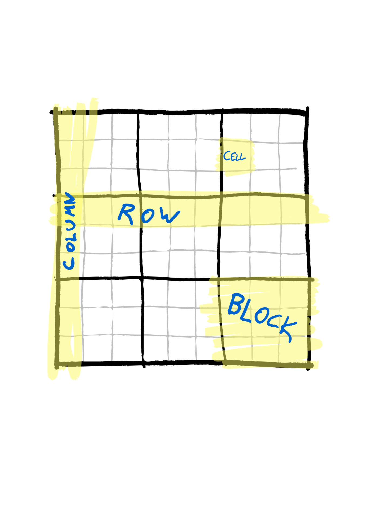

# Story mode description 

So this file will describe, in pretty much chronological order, what I've been up to here.

## Prologue - What are working with?


To choose a target for our speedup attempts, we're gonna look at a straightforward recursive Sudoku solver. 
To put all to the same page with the terminology, a [sudoku](https://en.wikipedia.org/wiki/Sudoku)
is a logical game where you have a 9x9 grid divided into 9 3x3 blocks:



The rule of the game is to fill the grid with numbers 1-9 such that any row, column or block
contains each of the numbers 1-9 exactly once. The difficulty of the game depends on which 
cells have been pre-filled with which numbers. Estimating the difficulty of a sudoku is
a non-trivial task, though if you are given starting configuration that has only one solution then adding legal numbers always
makes it easier. (Removing them might not as multiple solutions might emerge by reducing
restrictions, and if the starting solution has multiple solutions then adding a number might rule out simpler solutions.)

For the system we'll handle data input and output as strings of numbers, i.e. a single
sudoku will be an string of length 81, with each character one of the numbers 0-9. Here
with a 0 we will mean that a cell is unfilled. The numbers in this string are taken to 
be in such an order that they fill the standard 9x9 grid one by one, starting from top left
and moving through the cells left to right, top to bottom.

Internally we'll handle the Sudoku as a 9x9 grid of *possibilities*. By this I mean
that the content of any given sudoku cell will be an array of booleans, where each index
is representing if a given number could be allowed in that cell. We do this instead of
just having a 9x9 grid of numbers 0-9 for two reasons:
- This base architecture makes it much easier to include some more complicated strategies.
- We don't want to make the algorithm and the underlying structure *too* simple. Benchmarking Python vs Numpy vs C with a for loop doesn't sound interesting enough.

So the basic structure we'll look at will be something we call a *possibility grid*:
```
boolean p_grid[NUM_ROWS][NUM_COLS][NUM_POSSIBILITIES]
```
though all of the LITERAL_CONSTANTS here are actually just 9 and depending on the 
version, instead of booleans we might be using integers or chars.

Anyway, pseudocode for the main solver will look like this:
```python
def recursive_solver(sudoku : PossibilityGrid) -> bool:

    changed = True
    while(changed):
        changed = reduce_possibilities(sudoku) # Clever strategies

    if is_solved(sudoku):
        return True

    # Recursive brute forcing starts here:
    cell_idx = first_unsolved_cell_index(sudoku)
    possibilities = get_cell_possibilities(cell_idx, sudoku)
    for p in possibilities:
        local_sudoku = sudoku.copy()
        set_cell_of_sudoku(cell_idx, local_sudoku, p)

        result = recursive_solver(local_sudoku)
        if result:
            return True

    return False
```
So here the `reduce_possibilities` is responsible for clever strategies like "for this cell, the only number not yet appearing in its row, col and block is 5, so the only possibility for this cell is 5", where as the latter recursive part will just start brute forcing the solution after the clever stuff has failed. 

### What's our benchmark data?

I found a nice open source (Public Domain licennse) 
sudoku source on (kaggle)[https://www.kaggle.com/datasets/rohanrao/sudoku].
From that I sampled randomly 10k sudokus, which can be found in the folder `./data/` as a csv. This turned out to be a big enough sample to get various levels of difficulty without being too boring to wait to complete.

## Chapter 1 - Python versus C in various rounds

The main idea is that I take turns improving my Python solvers and C solvers, with the aim of
alternatively trying to close the gap with the Python versions and then trying to expand the
gap with C versions. The benchmarks were run (at the time of writing) on an Azure VM B2ms (2 vcpus, 8 GiB memory) running Ubuntu 18.04. In my rudimentary scorecard, getting Python within an order of magnitude range of C is a draw, and getting Python to take less than 5x the time that C takes is a win for Python.

### Round 1 - The baseline - Simple Python vs Simple C

I built a very straightforward implementation in Python 
(`./src/naive_sudoku_solver.py`).
It's called naive because it doesn't do anything fancy, though it aims to be as pythonic as possible
and not do too much obviously stupid things. On the benchmark machine  it solved
10k sudokus in just under 50 seconds.

To compete the naive Python version, I then made a simple C-version (`./C-version/sudoku_solver.c`). 
I call it simple because simple
C is the best I can do, and it probably does some obviously stupid things as well because I don't 
have a good touch to C. But in any case it runs and using the same algorithm it solves the same 10k
sudokus correctly in about 5 seconds - so an order of magnitude improvement right off the bat. 

|              | s/Sudoku | 10k Sudokus |
|--------------|----------|-------------|
| Naive Python | 5.1e-03  | 51s         |
| Naive C      | 5.4e-04  | 5.2s        |
|              |          |             |

So C-1, Python-0 at this point. Let's see how we could start improving the Python version a bit.


### Round 1.5 - OOP solution

Before we start to do anything fancy, I see that we're gonna be building Sudoku solvers that improve
or extend previous versions. Shouldn't we maybe do this in a more Object Oriented Programming way? 
It should surely make this nice in the long run, but doesn't OOP create extra baggage that will slow
everything down? Let's test this!

So in `./src/OOP_sudoku.py` we have the very same solver as before, but in as a Sudoku Solving Object. We run the results again and what we see is:

|              | s/Sudoku | 10k Sudokus |
|--------------|----------|-------------|
| Naive Python | 5.1e-03  | 51s         |
| Naive C      | 5.4e-04  | 5.2s        |
| OOP Python   | 4.9e-03  | 49s         |

So no, the Object structure doesn't bring any extra baggage, we're even a bit faster than we were with the naive solution. If we find the energy, we'll later on try to understand why we were faster
here. (I wouldn't be surprised if the answer has something to do with "optimizing bytocode interpreter".)

### Round 2 - Improved Naive Python

Let's start small before even trying to bring out the big guns. We take the OOP solver and try and see
if there is anything to optimize along the lines of "iterating over (long) lists is slow, dicts and other
hash-table based things are fast".


#### Analysis

First of all let's look at where we actually spend time in our current OOP solver by 
running the benchmark for that solver under cProfile:

```python -m cProfile -o OOP_solver.prof benchmark.py```

The results are kinda long, but let's look at the top time spenders based both on *cumulative time* which counts even when the given function has called another function
(and waiting for its results) and on *total time* which excludes time in sub-functions. The commands we run look like this:

```
$ python -m pstats OOP_solver.prof 
Welcome to the profile statistics browser.
OOP_solver.prof% strip
OOP_solver.prof% sort cumtime
OOP_solver.prof% stats 30
[...]
OOP_solver.prof% sort tottime
OOP_solver.prof% stats 30
```

And here are the results, first for cumulative time:
```
Mon Mar  6 10:11:01 2023    OOP_solver.prof

         252249901 function calls (252235248 primitive calls) in 114.974 seconds

   Ordered by: cumulative time
   List reduced from 696 to 30 due to restriction <30>

   ncalls  tottime  percall  cumtime  percall filename:lineno(function)
     44/1    0.000    0.000  115.336  115.336 {built-in method builtins.exec}
        1    0.000    0.000  115.336  115.336 benchmark.py:1(<module>)
        1    0.066    0.066  115.315  115.315 benchmark.py:15(run_benchmark)
    10000    0.038    0.000  114.444    0.011 OOP_sudoku.py:4(read_and_solve_sudoku_from_string)
24019/10000  0.170    0.000  112.645    0.011 OOP_sudoku.py:80(recursive_solver)
    84712    9.148    0.000   78.545    0.001 OOP_sudoku.py:171(reduce_possibilities)
  2135653    6.198    0.000   66.217    0.000 OOP_sudoku.py:197(get_simple_mask)
  6406959   21.542    0.000   44.162    0.000 OOP_sudoku.py:54(extract_exclusions)
    84712    1.542    0.000   29.708    0.000 OOP_sudoku.py:137(still_solvable)
  2287224   11.333    0.000   19.849    0.000 OOP_sudoku.py:44(collision_in_collection)
 88109228   17.485    0.000   17.639    0.000 {built-in method builtins.sum}
  2898061    9.392    0.000   11.871    0.000 OOP_sudoku.py:113(block)
 46275920    6.938    0.000    6.938    0.000 {method 'index' of 'list' objects}
 62948777    6.190    0.000    6.190    0.000 {method 'append' of 'list' objects}
  6406959    5.310    0.000    5.310    0.000 OOP_sudoku.py:56(<listcomp>)
  2898061    1.881    0.000    4.605    0.000 OOP_sudoku.py:110(col)
    84712    0.745    0.000    3.981    0.000 {built-in method builtins.all}
  6664729    1.971    0.000    3.238    0.000 OOP_sudoku.py:156(<genexpr>)
  2135653    3.202    0.000    3.202    0.000 OOP_sudoku.py:210(<listcomp>)
  6406959    2.807    0.000    2.807    0.000 OOP_sudoku.py:62(<listcomp>)
    24019    1.178    0.000    2.748    0.000 OOP_sudoku.py:241(__str__)
  2898061    2.724    0.000    2.724    0.000 OOP_sudoku.py:111(<listcomp>)
    14019    0.031    0.000    2.444    0.000 OOP_sudoku.py:231(copy)
  2824460    1.079    0.000    1.987    0.000 OOP_sudoku.py:19(p_array_to_num)
    24019    0.024    0.000    1.425    0.000 OOP_sudoku.py:76(__init__)
    24019    0.732    0.000    1.401    0.000 OOP_sudoku.py:28(convert_sudoku_string_to_p_grid)
    16974    0.292    0.000    0.937    0.000 OOP_sudoku.py:127(first_unsolved_cell_index)
     4295    0.814    0.000    0.814    0.000 OOP_sudoku.py:234(import_p_grid)
    10001    0.018    0.000    0.771    0.000 std.py:1174(__iter__)
      795    0.015    0.000    0.750    0.001 std.py:1212(update)
```
and then for total time:

```
Mon Mar  6 10:11:01 2023    OOP_solver.prof

         252249901 function calls (252235248 primitive calls) in 114.974 seconds

   Ordered by: internal time
   List reduced from 696 to 30 due to restriction <30>

   ncalls  tottime  percall  cumtime  percall filename:lineno(function)
  6406959   21.542    0.000   44.162    0.000 OOP_sudoku.py:54(extract_exclusions)
 88109228   17.485    0.000   17.639    0.000 {built-in method builtins.sum}
  2287224   11.333    0.000   19.849    0.000 OOP_sudoku.py:44(collision_in_collection)
  2898061    9.392    0.000   11.871    0.000 OOP_sudoku.py:113(block)
    84712    9.148    0.000   78.545    0.001 OOP_sudoku.py:171(reduce_possibilities)
 46275920    6.938    0.000    6.938    0.000 {method 'index' of 'list' objects}
  2135653    6.198    0.000   66.217    0.000 OOP_sudoku.py:197(get_simple_mask)
 62948777    6.190    0.000    6.190    0.000 {method 'append' of 'list' objects}
  6406959    5.310    0.000    5.310    0.000 OOP_sudoku.py:56(<listcomp>)
  2135653    3.202    0.000    3.202    0.000 OOP_sudoku.py:210(<listcomp>)
  6406959    2.807    0.000    2.807    0.000 OOP_sudoku.py:62(<listcomp>)
  2898061    2.724    0.000    2.724    0.000 OOP_sudoku.py:111(<listcomp>)
  6664729    1.971    0.000    3.238    0.000 OOP_sudoku.py:156(<genexpr>)
  2898061    1.881    0.000    4.605    0.000 OOP_sudoku.py:110(col)
    84712    1.542    0.000   29.708    0.000 OOP_sudoku.py:137(still_solvable)
    24019    1.178    0.000    2.748    0.000 OOP_sudoku.py:241(__str__)
  2824460    1.079    0.000    1.987    0.000 OOP_sudoku.py:19(p_array_to_num)
     4295    0.814    0.000    0.814    0.000 OOP_sudoku.py:234(import_p_grid)
    84712    0.745    0.000    3.981    0.000 {built-in method builtins.all}
    24019    0.732    0.000    1.401    0.000 OOP_sudoku.py:28(convert_sudoku_string_to_p_grid)
  2898061    0.513    0.000    0.513    0.000 OOP_sudoku.py:107(row)
4577538/4577451    0.494    0.000    0.494    0.000 {built-in method builtins.len}
      799    0.373    0.000    0.373    0.000 {method 'write' of '_io.TextIOWrapper' objects}
    16974    0.292    0.000    0.937    0.000 OOP_sudoku.py:127(first_unsolved_cell_index)
  1945539    0.200    0.000    0.200    0.000 {method 'copy' of 'list' objects}
24019/10000    0.170    0.000  112.645    0.011 OOP_sudoku.py:80(recursive_solver)
   464825    0.110    0.000    0.153    0.000 utils.py:330(<genexpr>)
    24019    0.108    0.000    0.670    0.000 OOP_sudoku.py:31(<listcomp>)
        1    0.066    0.066  115.315  115.315 benchmark.py:15(run_benchmark)
   462434    0.044    0.000    0.044    0.000 {built-in method unicodedata.east_asian_width}
```

For now I think the best place to focus on is the top of the total time, in particular these lines:
```
   ncalls  tottime  percall  cumtime  percall filename:lineno(function)
  6406959   21.542    0.000   44.162    0.000 OOP_sudoku.py:54(extract_exclusions)
 88109228   17.485    0.000   17.639    0.000 {built-in method builtins.sum}
  2287224   11.333    0.000   19.849    0.000 OOP_sudoku.py:44(collision_in_collection)
  2898061    9.392    0.000   11.871    0.000 OOP_sudoku.py:113(block)
    84712    9.148    0.000   78.545    0.001 OOP_sudoku.py:171(reduce_possibilities)
 46275920    6.938    0.000    6.938    0.000 {method 'index' of 'list' objects}
  2135653    6.198    0.000   66.217    0.000 OOP_sudoku.py:197(get_simple_mask)
 62948777    6.190    0.000    6.190    0.000 {method 'append' of 'list' objects}
 ```

So here we see that the biggest time consumers consist of a few built-in methods -
`sum`, `list.index` and `append` - together with a few methods we've built, namely
`extract_exclusions`, `collisions_in_collection`, `block`, `reduce_possibilities` and `get_simple_mask`.

Looking at how these transgressors interact, we note that the appending to list only happens
in the methods `collisions_in_collection`, `block`, `reduce_possibilities` and the magic
method `__str__` which is used in the copying of a sudoku. 
The built-in `sum` method is also used only in methods listed above, together with another
static method called `p_array_to_num` which has also found its way to the top 30 of both lists.

So looking how these different subparts consume our CPU time, we note that there might be chances to improve. For example, looking at our `extract_exclusions` method which holds top rank in both total and cumulative times, we see that we are using the `sum` only to detect if a given 
possibility array is already completely determined. And in fact, most of the uses of `sum`
are only used to figure out if a given probability array has only a single '1' in it. This seeems
like an overkill.

So instead of sums, let's do a faster lookup. There are only 9 possibilities for 
an array of length 9 to have only one '1', so let's enumerate them and turn the check into
a dictionary lookup. To do this, though, we need something hashable, so we need to turn from 
lists to tuples. Let's go one step further: we'll change the whole Sudoku data format from 3-dimensional list to a 2-dimensional list of tuples!

So what we changed going from `OOP_sudoku.py` to `OOP_sudoku_improved.py` was:
1. Turned the whole "from possibility array to number and back" thing to rely on 
dictionary lookups of pre-stored tuples.
2. Changed the internal sudoku format to have all the possibility arrays to be tuples
instead of lists.
3. Reduced for loops by adding more early returns, plus other minor improvements.

And here are the results:

|              | s/Sudoku | 10k Sudokus |
|--------------|----------|-------------|
| Naive Python | 5.1e-03  | 51s         |
| Naive C      | 5.4e-04  | 5.2s        |
| OOP Python   | 4.9e-03  | 49s         |
| Improved OOP Python | 4.7e-03 | 47s |

So with all that work we shaved about four percents off our running time. cProfiler tells that for the total time the biggest time users are now:
```
   ncalls  tottime  percall  cumtime  percall filename:lineno(function)
  6406959   20.422    0.000   33.407    0.000 OOP_sudoku_improved.py:47(extract_exclusions)
 81526820   16.343    0.000   16.343    0.000 OOP_sudoku_improved.py:35(p_array_to_num)
  2287224    9.319    0.000   15.190    0.000 OOP_sudoku_improved.py:73(collision_in_collection)
    84712    9.137    0.000   65.780    0.001 OOP_sudoku_improved.py:179(reduce_possibilities)
  2898061    8.713    0.000   10.813    0.000 OOP_sudoku_improved.py:124(block)
  2135653    5.703    0.000   53.776    0.000 OOP_sudoku_improved.py:205(get_simple_mask)
 62948777    5.046    0.000    5.046    0.000 {method 'append' of 'list' objects}
  2135653    3.099    0.000    3.099    0.000 OOP_sudoku_improved.py:218(<listcomp>)
  6406959    2.731    0.000    2.731    0.000 OOP_sudoku_improved.py:49(<listcomp>)
  2898061    2.562    0.000    2.562    0.000 OOP_sudoku_improved.py:122(<listcomp>)
  2898061    1.776    0.000    4.338    0.000 OOP_sudoku_improved.py:121(col)
```

So one of the big differences is that we pushed the 17 or so seconds used by `sum` to the
`p_array_to_num` function here. So I guess the lesson here is that `sum(short_list) == 1` is also very fast?


### Round 3 - Numpy

So, Sudoku is pretty much a glorified matrix, and numpy is good with matrices.
This should be a no-brainer. In `./src/numpy_sudoku.py` we have the OOP solver rewritten in such
a way that the sudoku is not a 3-dimensional list but a 3-dimensional numpy-integer array. 

|              | s/Sudoku | 10k Sudokus |
|--------------|----------|-------------|
| Naive Python | 5.1e-03  | 51s         |
| Naive C      | 5.4e-04  | 5.2s        |
| OOP Python   | 4.9e-03  | 49s         |
| Improved OOP Python | 4.7e-03 | 47s |
| First numpy solver | 3.3e-02 | 330s |

So the first attempt to numpy solve this is that we spend an order of magnitude more solving it. 
This is pretty much the opposite of what I wanted. Let's fire up the good old cProfile to see
what is going on.


From `numpy_solver.prof`
```
Tue Mar  7 11:28:23 2023    numpy_solver.prof

         456300559 function calls (456284372 primitive calls) in 515.038 seconds

   Ordered by: internal time
   List reduced from 1230 to 20 due to restriction <20>

   ncalls  tottime  percall  cumtime  percall filename:lineno(function)
 28669199   65.544    0.000   65.544    0.000 {method 'reduce' of 'numpy.ufunc' objects}
    84712   53.859    0.001  395.698    0.005 numpy_sudoku.py:159(reduce_possibilities)
  6406959   52.711    0.000   67.175    0.000 function_base.py:5054(delete)
  8694183   38.006    0.000  217.958    0.000 numpy_sudoku.py:60(get_fixed_projection_array)
 50766043   36.277    0.000  240.813    0.000 {built-in method numpy.core._multiarray_umath.implement_array_function}
 19861988   26.811    0.000   87.349    0.000 fromnumeric.py:69(_wrapreduction)
  8807211   22.568    0.000   56.763    0.000 numpy_sudoku.py:20(p_array_to_num)
 17490052   20.292    0.000  102.563    0.000 fromnumeric.py:2188(sum)
  2898061   17.290    0.000   23.512    0.000 numpy_sudoku.py:110(block)
 17490052   13.594    0.000  128.313    0.000 <__array_function__ internals>:177(sum)
  6406959   10.396    0.000  252.591    0.000 numpy_sudoku.py:53(extract_exclusions)
  2135653   10.322    0.000   10.322    0.000 numpy_sudoku.py:198(<listcomp>)
  8694183   10.192    0.000   10.192    0.000 {method 'take' of 'numpy.ndarray' objects}
  ```

```
Tue Mar  7 11:28:23 2023    numpy_solver.prof

         456300559 function calls (456284372 primitive calls) in 515.038 seconds

   Ordered by: cumulative time
   List reduced from 1230 to 30 due to restriction <30>

   ncalls  tottime  percall  cumtime  percall filename:lineno(function)
    141/1    0.000    0.000  515.038  515.038 {built-in method builtins.exec}
        1    0.000    0.000  515.038  515.038 benchmark.py:1(<module>)
        1    0.048    0.048  514.884  514.884 benchmark.py:20(run_benchmark)
    10000    0.048    0.000  513.466    0.051 numpy_sudoku.py:5(read_and_solve_sudoku_from_string)
24019/10000    0.216    0.000  500.796    0.050 numpy_sudoku.py:77(recursive_solver)
    84712   53.859    0.001  395.698    0.005 numpy_sudoku.py:159(reduce_possibilities)
  2135653   10.143    0.000  294.213    0.000 numpy_sudoku.py:185(get_simple_mask)
  6406959   10.396    0.000  252.591    0.000 numpy_sudoku.py:53(extract_exclusions)
 50766043   36.277    0.000  240.813    0.000 {built-in method numpy.core._multiarray_umath.implement_array_function}
  8694183   38.006    0.000  217.958    0.000 numpy_sudoku.py:60(get_fixed_projection_array)
 17490052   13.594    0.000  128.313    0.000 <__array_function__ internals>:177(sum)
 17490052   20.292    0.000  102.563    0.000 fromnumeric.py:2188(sum)
 19861988   26.811    0.000   87.349    0.000 fromnumeric.py:69(_wrapreduction)
    84712    2.751    0.000   86.997    0.001 numpy_sudoku.py:124(still_solvable)
  6406959    5.251    0.000   78.532    0.000 <__array_function__ internals>:177(delete)
  2287224    6.429    0.000   75.701    0.000 numpy_sudoku.py:47(collision_in_collection)
  6406959   52.711    0.000   67.175    0.000 function_base.py:5054(delete)
 28669199   65.544    0.000   65.544    0.000 {method 'reduce' of 'numpy.ufunc' objects}
  8807211   22.568    0.000   56.763    0.000 numpy_sudoku.py:20(p_array_to_num)
  8694183    6.475    0.000   36.872    0.000 <__array_function__ internals>:177(take)
 14855826    9.852    0.000   25.918    0.000 <__array_function__ internals>:177(where)

 ```
We see especially from the total time calculations that we are spending a lot of time doing numpy-internal methods like `reduce`, `delete` and `implement_array_function`. My very non-expert feeling here is that we are paying a lot for the overhead of the numpy machiner that allows us to make really fast computations for large dimensional array linear algebra calculations? So my current guess is that numpy overhead is killing our speed improvements.


 Note that in this line:
 ```
 ncalls         tottime  percall  cumtime    percall filename:lineno(function)
 24019/10000    0.216    0.000    500.796    0.050   numpy_sudoku.py:77(recursive_solver)
 ```
we can easily see from `ncalls` that the main recursive solver was called 10k times at the outset, 
and then 24k times internally. This gives not only an average recursion depth, but seeing that this
number is same for all the different versions of Python sudoku solvers we've used, we have strong
evidence that they are using essentially the same recursive algorithm with same recursion depths.
So the problem with the numpy version is not some subtle mistake about the recursive algo not exiting early enough, but just about the numpy version not being faster. Maybe the library that is built to handle 1 000 000 -dimensional float arrays and matrix multiplications of similar dimensions has some overhead when used to handle a 9x9x9 matrix of ones and zeroes? Who knew! (Option two: I'm doing something stupid with numpy here. At some point I'll go find numpy-based sudoku solvers of other people and see how they did it.)

## Interlude - What did we learn here?

> Premature optimization is the root of all evil.

So, before actually trying to do this, my knee-jerk reaction would have been
to do this with numpy since numpy is fast with matrices. Turns out that that would have been a bad idea.

## Chapter 2 - Using C within Python

If you can't beat them, join them! Next we'll try and see how to use the superiorly fast C in Python versions.
The benchmarking has seen two ways of invoking the C-code, both in the `./src/CLI_C_caller.py` file.
One of them passes the C-code sudokus as cli parameters and scrapes the results:
```python
def read_and_solve_sudoku_from_string(input_sudoku: str) -> str:
    stream = os.popen(f"./C-version/a.out -r {input_sudoku} -S")
    output = stream.read()
    return output.strip("\n")
```
the othe passes the test data filepath to the C-function who knows how to read that:
```python
def run_C_benchmark(test_data) -> str:
    stream = os.popen(f'./C-version/a.out -B "{test_data}"')
    output = stream.read()
    return output
```

With calling C via
command line we are losing a lot of the benefits from C:

|              | s/Sudoku | 10k Sudokus |
|--------------|----------|-------------|
| Naive Python | 5.1e-03  | 51s         |
| C - CSV     | 5.4e-04  | 5.7s        |
| C - line-by-line   | 2.4e-03  | 49s  |


So clearly the way to go is to build the C-system as something that we can call directly! After studying the [Real Python tutorial](https://realpython.com/build-python-c-extension-module/) on the topic, it was almost easy to package the C-code as a Python package. As a caveat to those trying to repeat this: you're not supposed to `gcc sudoku_solver_module.c`, it won't work and you'll spend hours trying to troubleshoot a wrong thing.

Anyway. `./C-version/sudoku_solver_module.c` contains the module that can be turned into a Python package called `RamiSudoku`. To do this, **after activating your virtual environment**,
run `python setup.py install` in the folder `./C-version`.

|              | s/Sudoku | 10k Sudokus |
|--------------|----------|-------------|
| Naive Python | 5.3e-03  | 53s         |
| C - CSV      | 5.7e-04  | 5.7s        |
| C - line-by-line   | 2.4e-03  | 24s  |
| C based Python package | 1.1e-04 | 1.1s |

So, somewhat surprisingly, the Python-packaged version
is **five times faster** than my naive C. I'm guessing here
that the Python file reader was written by an actually
competent C-developer, unlike my version of getting the test and comparison
data from the csv. 

### Python 3.11

Speaking of competent developers, the word on the street is that Python 3.11
can provide considerable speed improvements compared to earlier versions. 
Let's run the benchmarks again but compare to Python 3.11 when suitable!

|              |  10k Sudokus w/ 3.10 |  10k Sudokus w/ 3.11 | Speed increase |
|--------------|-------------|-------------|-------|
| Naive Python |  53s         | 42s | 23% |
| OOP Python   |  50s         | 40s | 25% |
| Improved OOP Python | 48s | 37s | 30% |
| First numpy solver |  350s |  320s  | 9% |
| C - CSV      |  5.7s        | 5.4s | 5% |
| C - line-by-line   | 24s  | 24s | 0% |
| C based Python package |  1.1s | 1.1s |0% |

Not bad, 25-ish percent improvments on the more Python-heavy solutions,
and even a 5% improvement on the wrapped C-benchmark.


## Interlude - What did we learn?

We learned a few things:
1. C is faster than Python **when in the hands of a competent dev**. My Python-packaged C-solver is faster than my raw C-solver, which clearly indicates
that I am doing something silly in my C-version.
2. Read tutorials through and don't start to solo around. But if you don't and do, then when running to weird error messages, try to go back to patiently following the tutorial.
3. Don't guess, always try out and test. I would not have guessed Numpy-version to be so slow or the C-extension module to be faster than my naive C-version.


**TO APPEAR**

## Chapter 3 - How did others do it?


## Epilogue - What did we learn
