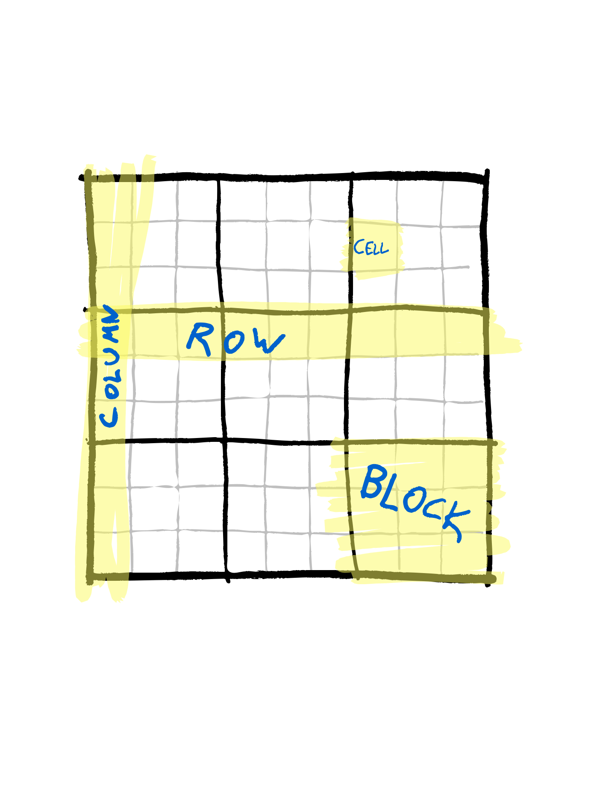

# My personal speed analysis repo

[](https://github.com/psf/black)


The goal of this repo is to study the speed increases that can be achived
from going first from 'naive Python' to 'numpy Python', and then to either
building specific crucial parts as C-libraries, or to building the whole system
in C. The differences are benchmarked with a simple recursive Sudoku solver.

## Introduction

Here I'm describing some general ideas. If you just wanna get started, 
jump to the next section ('Getting Started').

### Why?

C is faster than Python. There is very little question about that. But
there is a much smaller difference between a Python program correctly using 
e.g. numpy, pandas or one of the other fast libraries with a C back-end.
In particular, in many cases (including mine) the important question is whether *I* 
the Python programmer could write C-code that runs faster than the implementations that rely
on the Python libraries whose C backends have been written by professional
C developers.

### How?

To choose a target, we're gonna look at a straightforward recursive Sudoku solver. 
To put all to the same page with the terminology, a [sudoku](https://en.wikipedia.org/wiki/Sudoku)
is a logical game where you have a 9x9 grid divided into 9 3x3 blocks:




The rule of the game is to fill the grid with numbers 1-9 such that any row, column or block
contains each of the numbers 1-9 exactly once. The difficulty of the game depends on which 
cells have been pre-filled with which numbers. Estimating the difficulty of a sudoku is
a non-trivial task, though given starting configuration adding legal numbers always
makes it easier. (Removing them might not as multiple solutions might emerge by reducing
restrictions.)

For the system we'll handle data input and output as strings of numbers, i.e. a single
sudoku will be an string of length 81, with each character one of the numbers 0-9. Here
with a 0 we will mean that a cell is unfilled. The numbers in this string are taken to 
be in such an order that they fill the standard 9x9 grid one by one, starting from top left
and moving through the cells left to right, top to bottom.


Pseudocode for the solver.
```python
def recursive_solver(sudoku : ThreeDimensionalArray) -> bool:

    changed = True
    while(changed):
        changed = reduce_possibilities(sudoku)

    if is_solved(sudoku):
        return True

    cell_idx = first_unsolved_cell_index(sudoku)
    possibilities = get_cell_possibilities(cell_idx, sudoku)
    for p in possibilities:
        local_sudoku = sudoku.copy()
        set_cell_of_sudoku(cell_idx, local_sudoku, p)

        result = recursive_solver(local_sudoku)
        if result:
            return True

    return False
```


## Getting started


### Fast start:
```
conda create --name SudokuSpeedBenchmark python=3.10
conda activate SudokuSpeedBenchmark
pip install requirements.txt
python benchmark.py
```

### Exploratory start:

```
conda create --name SudokuSpeedExploratory python=3.10
conda activate SudokuSpeedExploratory
pip install requirements.txt
```
Then open the `Exploration.ipynb` -notebook and read on.


# Todo / Ideas

Create a dict with precalculated block indeces?
- How about a dict that contains the "array_to_num" (and num_to_array) conversions?

Run better diagnostics on what takes most time

Check if OOP affects speed -- recurse the whole object.

